# Домашнее задание к занятию "Что такое DevOps? CI/CD" - Даниил Оберган

---

### Задание 1
Настройки проекта:
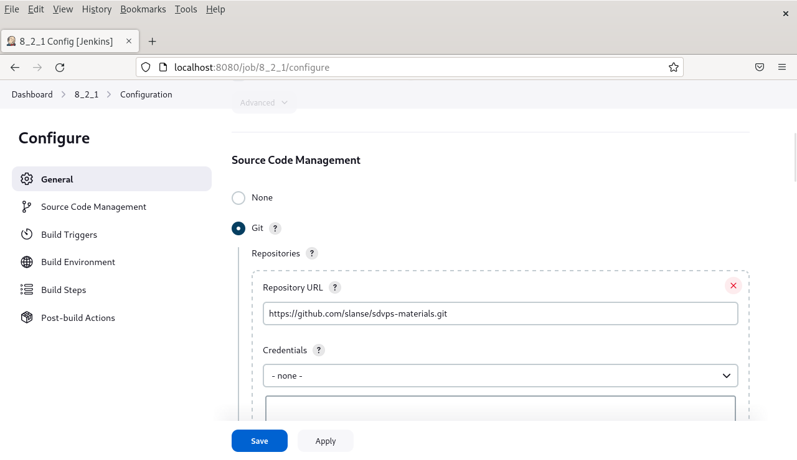
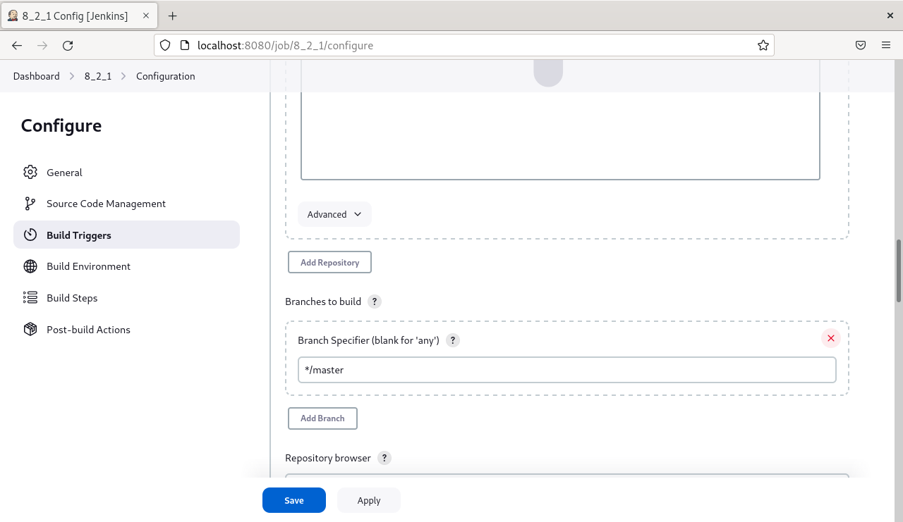

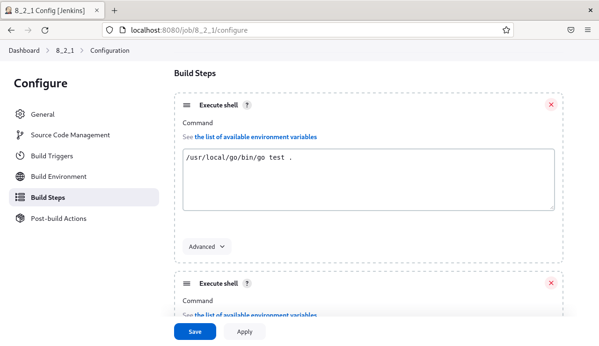
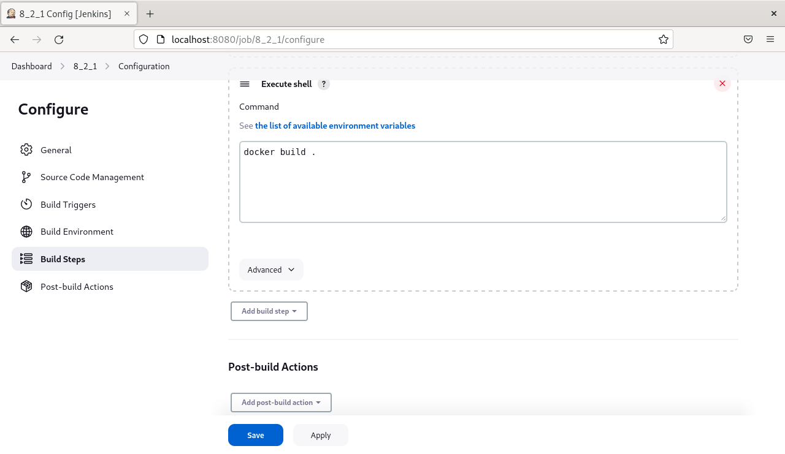
Выполнение сборки:
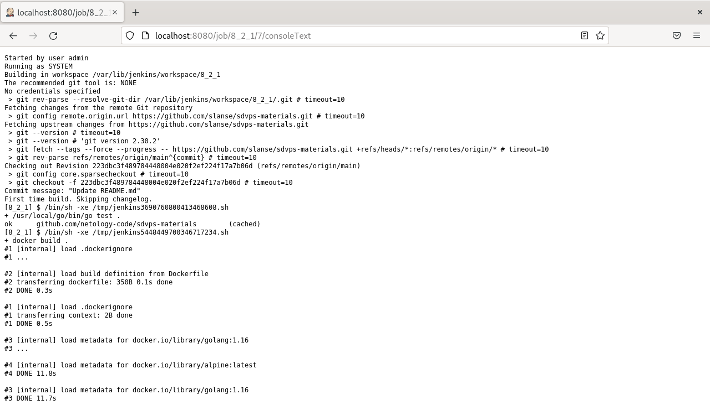
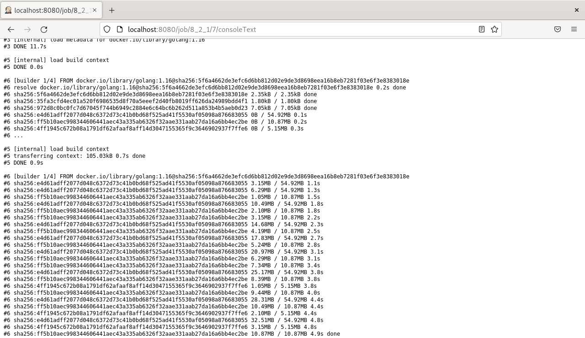
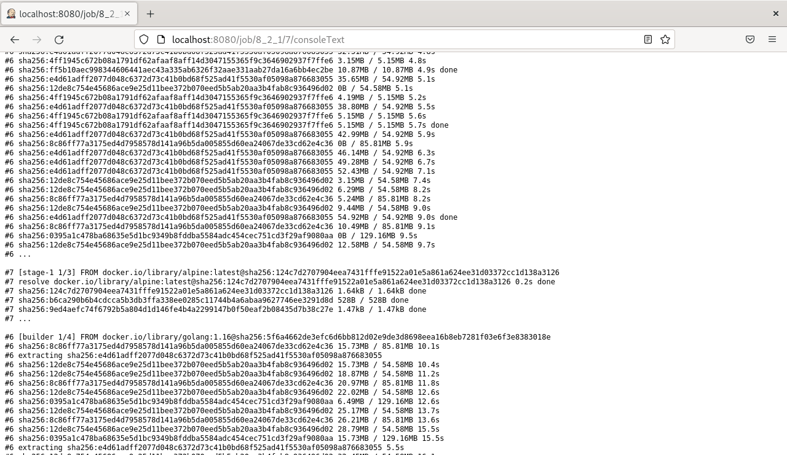
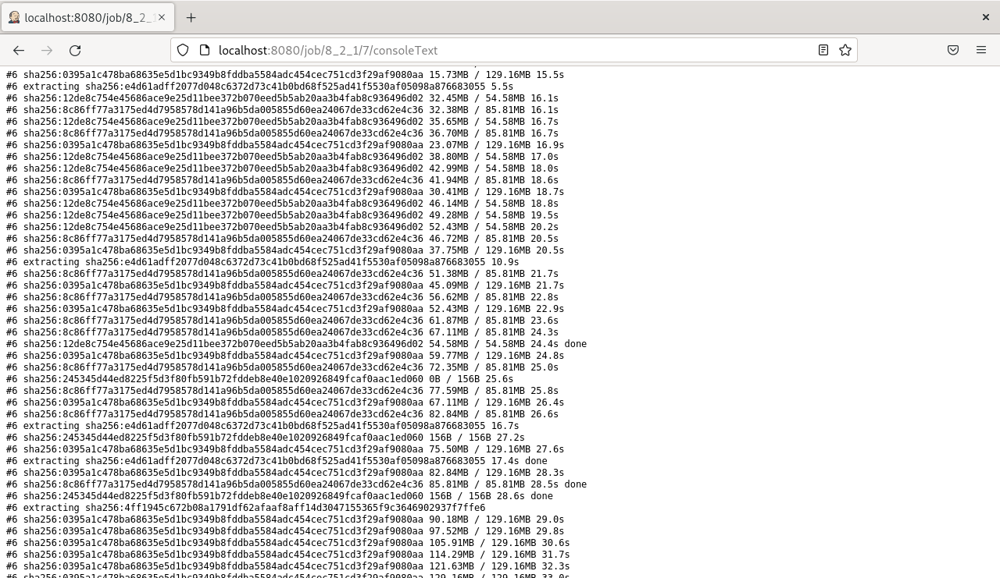
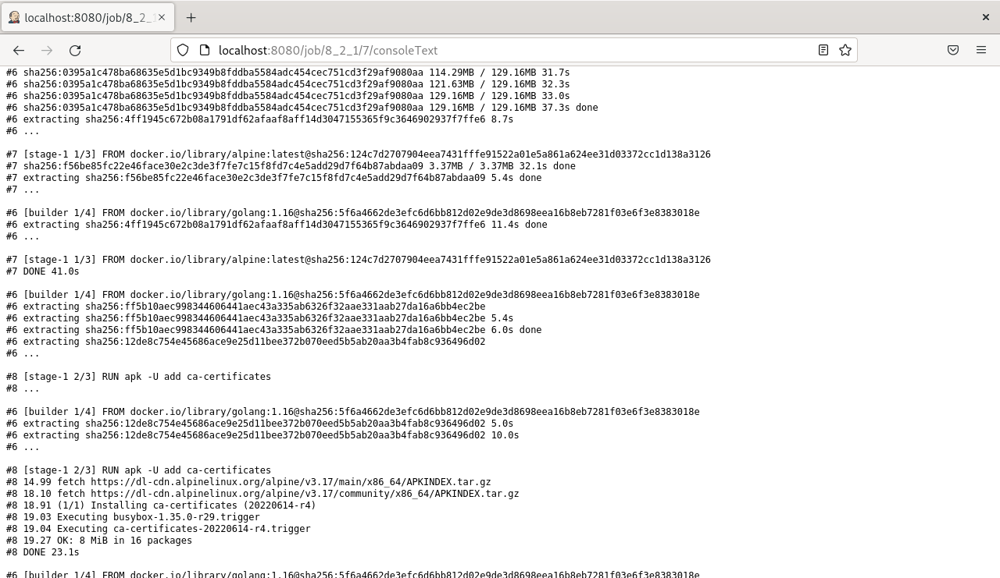
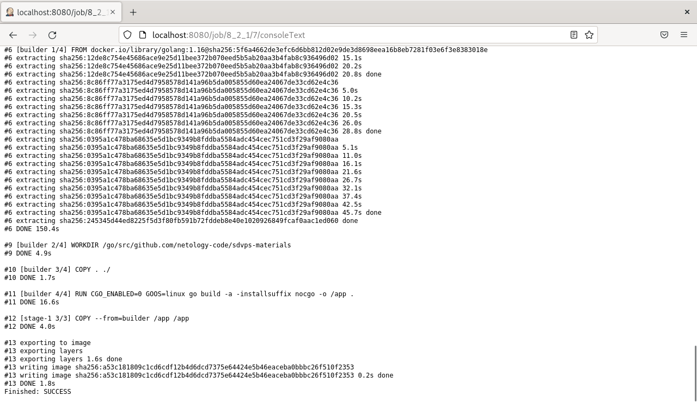

---

### Задание 2

Настройки проекта:
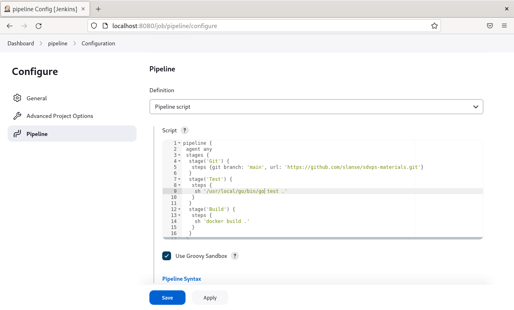
Выполнение сборки:

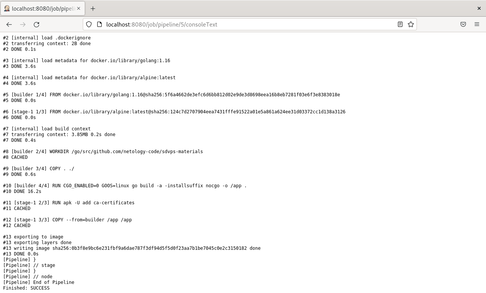

---

### Задание 3

Настройки проекта:
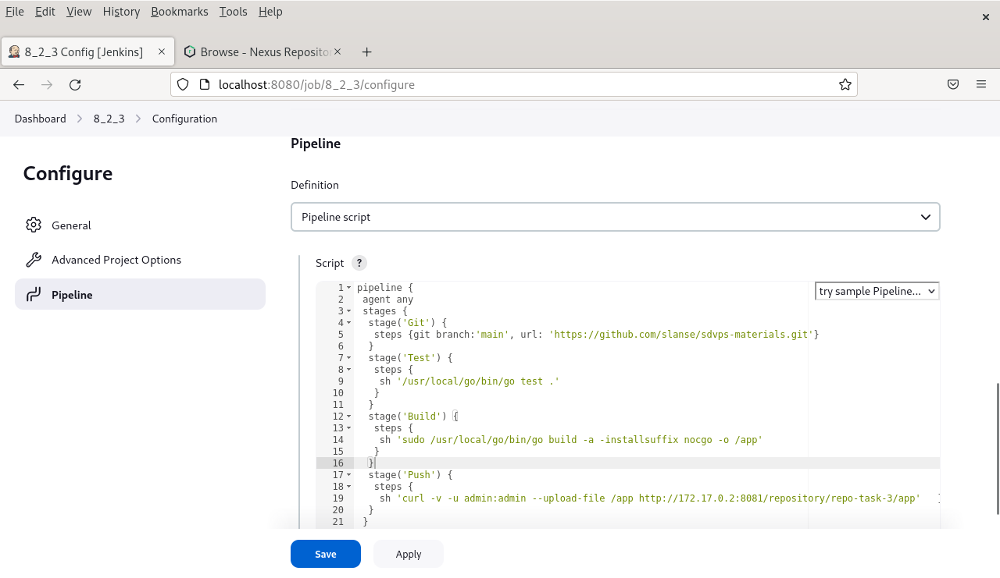
Выполнение сборки:

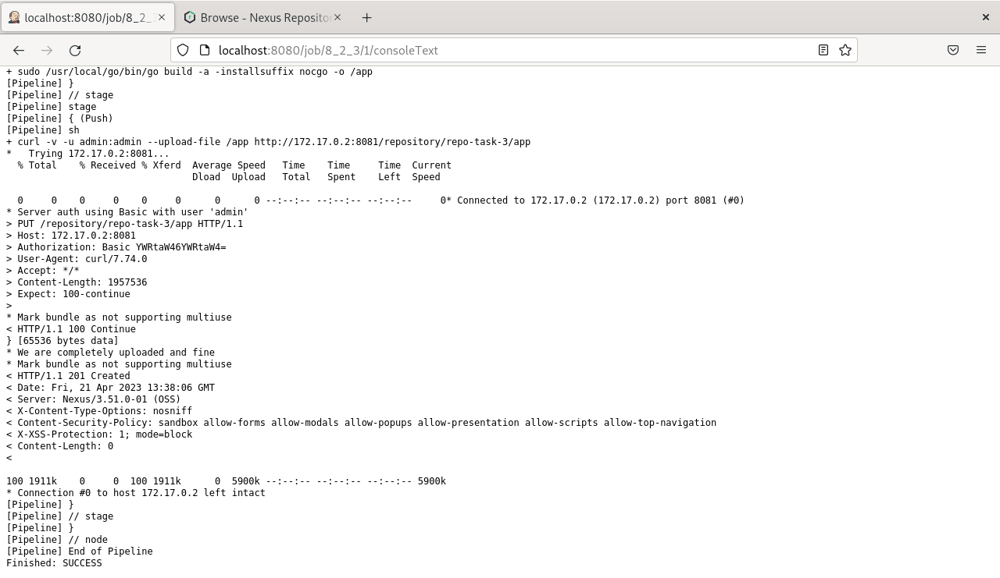

---

### Задание 4

Настройки проекта:
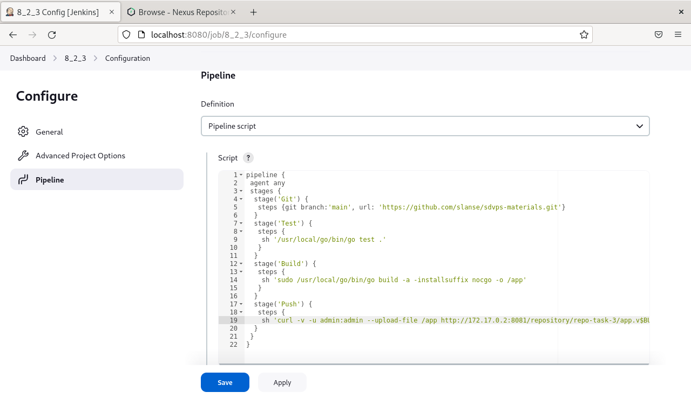
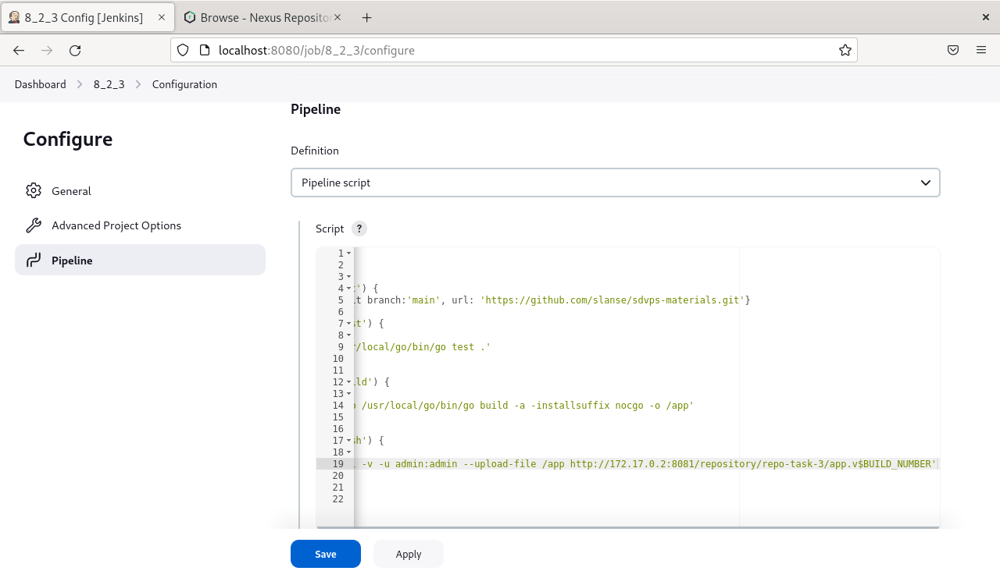
Выполнение сборки:
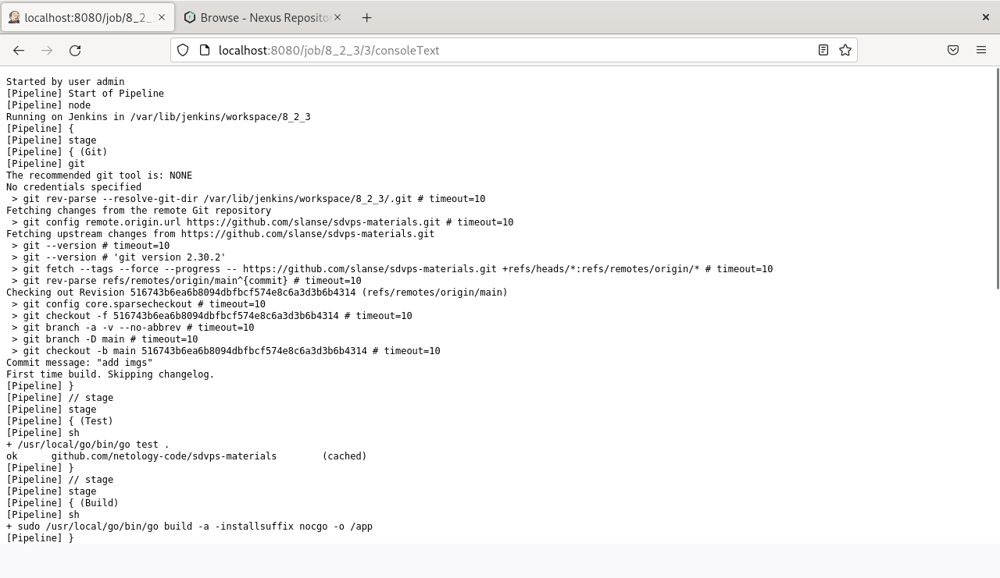

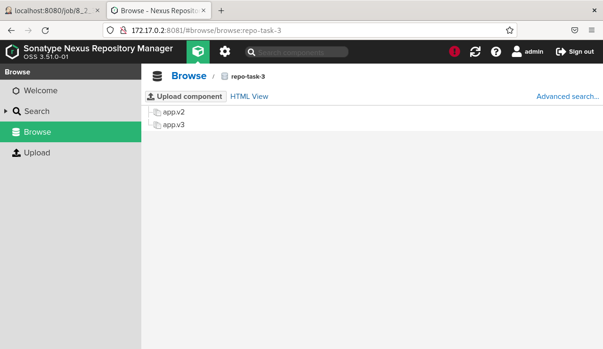
