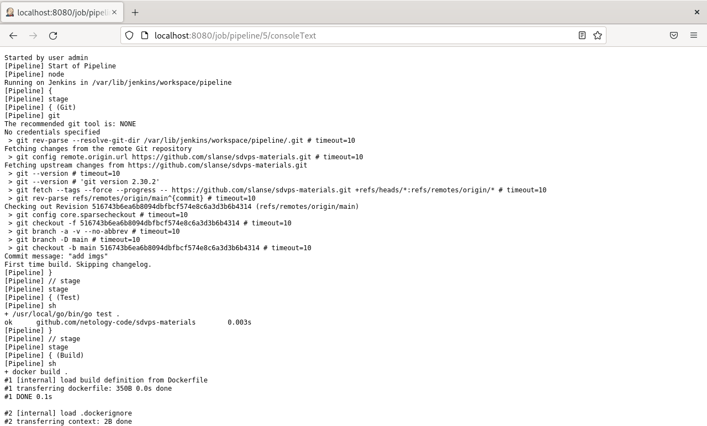

# Домашнее задание к занятию "Что такое DevOps? CI/CD" - Даниил Оберган

---

### Задание 1
Настройки проекта:

Выполнение сборки:

---

### Задание 2

Настройки проекта:

Выполнение сборки:

---

### Задание 3

Настройки проекта:

Выполнение сборки:

---

### Задание 4

Настройки проекта:

Выполнение сборки:

