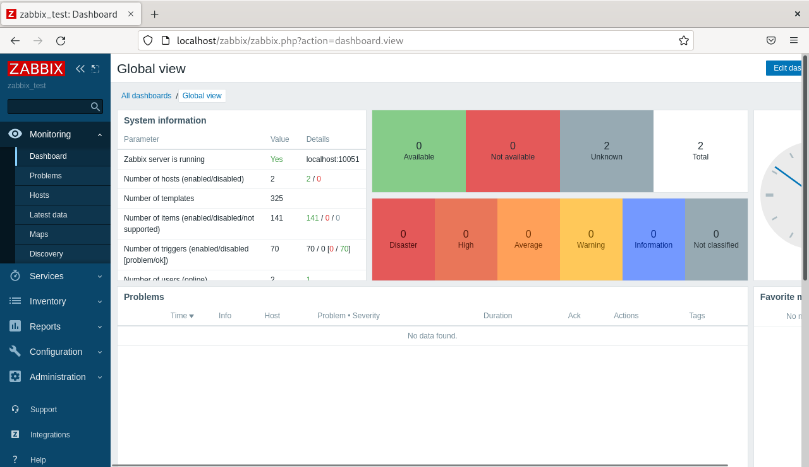

# Домашнее задание к занятию «Система мониторинга Zabbix» - Даниил Оберган

---

### Задание 1



```bash
sudo apt install postgresql
wget https://repo.zabbix.com/zabbix/6.0/debian/pool/main/z/zabbix-release/zabbix-release_6.0-4+debian11_all.deb
dpkg -i zabbix-release_6.0-4+debian11_all.deb
apt update
apt install zabbix-server-pgsql zabbix-frontend-php php7.4-pgsql zabbix-apache-conf zabbix-sql-scripts zabbix-agent
sudo -u postgres createuser --pwprompt zabbix
sudo -u postgres createdb -O zabbix zabbix
sudo nano /etc/zabbix/zabbix_server.conf
sudo systemctl restart zabbix-server zabbix-agent apache2
sudo systemctl enable zabbix-server zabbix-agent apache2
```

---

### Задание 2

Приложите в файл README.md скриншот раздела Configuration > Hosts, где видно, что агенты подключены к серверу


Приложите в файл README.md скриншот лога zabbix agent, где видно, что он работает с сервером


Приложите в файл README.md скриншот раздела Monitoring > Latest data для обоих хостов, где видны поступающие от агентов данные.


Приложите в файл README.md текст использованных команд в GitHub

```bash
wget https://repo.zabbix.com/zabbix/6.0/debian/pool/main/z/zabbix-release/zabbix-release_6.0-4+debian11_all.deb
dpkg -i zabbix-release_6.0-4+debian11_all.deb
apt update
sudo apt install zabbix-agent -y
sudo systemctl restart zabbix-agent
sudo systemctl enable zabbix-agent
```
