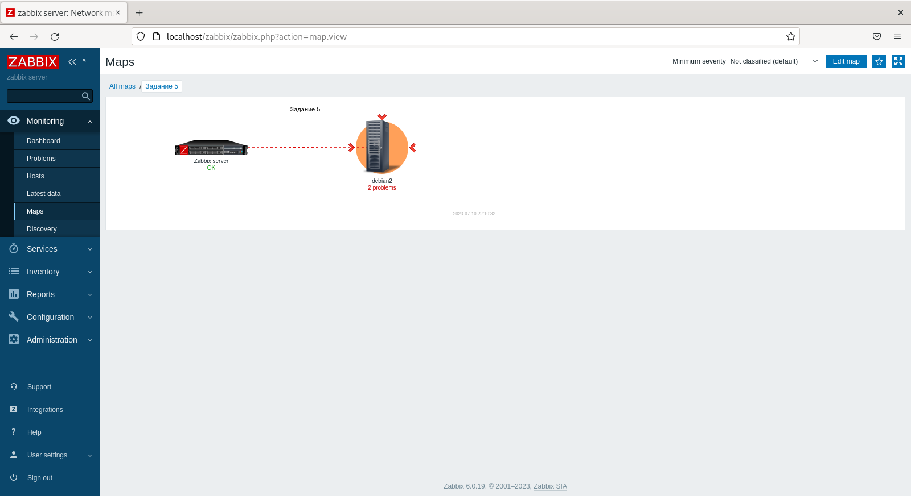
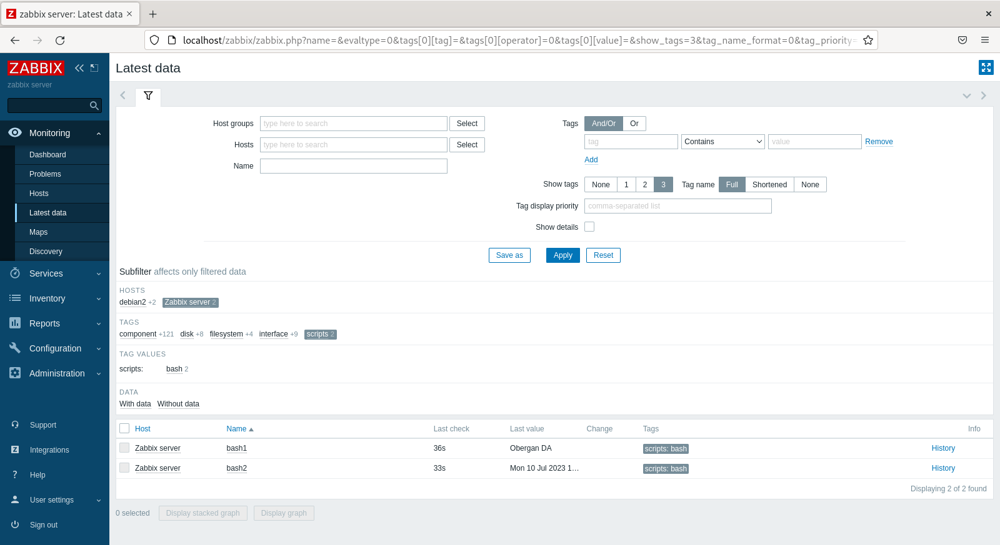

# Домашнее задание к занятию «Система мониторинга Zabbix. Часть 2» - Даниил Оберган

---

### Задание 1

Прикрепите в файл README.md скриншот страницы шаблона с названием «Задание 1»


---

### Задания 2,3

Прикрепите в файл README.md скриншот страницы хостов, где будут видны привязки шаблонов с названиями «Задание 2-3». Хосты должны иметь зелёный статус подключения


---

### Задание 4

Прикрепите в файл README.md скриншот дашборда с названием «Задание 4»


---

### Задание 5

Прикрепите в файл README.md скриншот карты, где видно, что триггер сработал, с названием «Задание 5»



---

### Задание 6

Прикрепите в файл README.md код скрипта, а также скриншот Latest data с результатом работы скрипта на bash, чтобы был виден результат работы скрипта при отправке в него 1 и 2

```bash
!/bin/bash
if [[ $1 -eq 1 ]]; then
    echo Obergan DA
elif [[ $1 -eq 2 ]]; then
    date
fi
```



