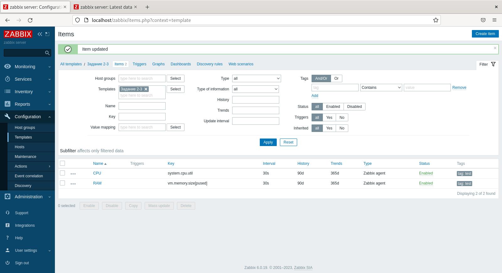
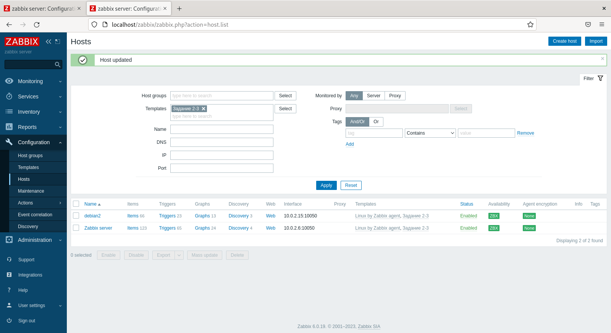
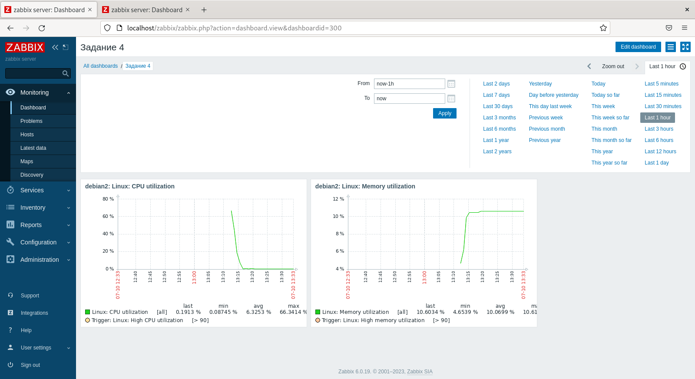

# Домашнее задание к занятию «Система мониторинга Zabbix. Часть 2» - Даниил Оберган

---

### Задание 1

Прикрепите в файл README.md скриншот страницы шаблона с названием «Задание 1»

---

### Задания 2,3

Прикрепите в файл README.md скриншот страницы хостов, где будут видны привязки шаблонов с названиями «Задание 2-3». Хосты должны иметь зелёный статус подключения

---

### Задание 4

Прикрепите в файл README.md скриншот дашборда с названием «Задание 4»

